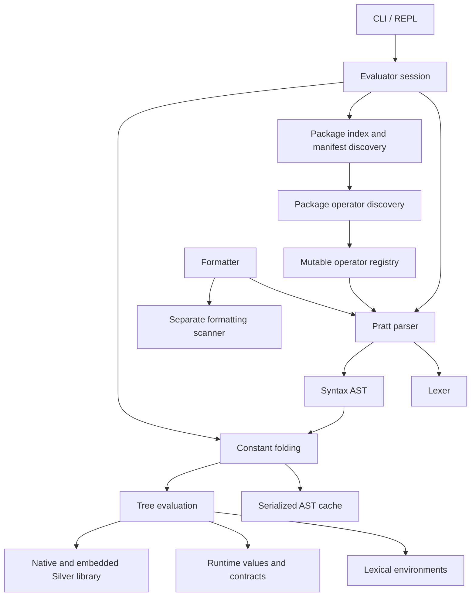

# Silver architecture and implementation review

Reviewed 2026-09-12 against root commit `c0883ac` (`removing concurrency model`), reporting version 0.9.0.

Silver has a viable core worth retaining: a small interpreter, a readable Pratt parser, nominal structs with callable fields, and a substantial test suite. Its main architectural weakness is that syntax, resolved types, lexical bindings, execution state, and package identity do not have sufficiently distinct owners. Features added later cross those boundaries in different ways. This produces observable failures when otherwise working features are combined.

The highest-value work is to stabilize those boundaries before changing declaration spelling or replacing the parser. A `type` declaration would improve consistency, but would not itself repair typing or package semantics.

## Scope and evidence

The review covers the root implementation: lexer, parser, AST, runtime objects and environments, evaluator, packages, AST caching, formatter, CLI/REPL, and standard-library integration. Standard-library modules were sampled rather than individually audited. A brief comparison to the separate, untracked `silver/` module appears below; it is not assumed to be the intended replacement.

The root has 197 tracked Go files, including 86 test files. Validation on Windows/amd64 with Go 1.25.2:

| Check | Result |
| --- | --- |
| `go test ./...` | Pass |
| `go vet ./...` | Pass |
| `go test ./... -count=1 -cover` | Pass |
| Additional targeted probes | Confirmed the behaviors reported below |

Selected package coverage: evaluator 84.9%, parser 84.1%, lexer 88.3%, packages 80.1%, formatter 90.3%, AST cache 84.3%, standard library 76.4%. These are Go's per-package statement figures, not proof of language conformance. For example, AST behavior exercised through evaluator tests is not fully represented by the AST package's own coverage number.

The additional probes were standalone Go drivers and Silver fixtures outside the repository. They exercised the actual root parser/evaluator and public file/tooling APIs. An “observed result” below is the evaluator's final value; the file-running CLI does not automatically print final expressions. No language implementation was changed. No fuzzing, performance benchmarking, exhaustive standard-library audit, or non-Windows execution was performed. No tracked fuzz targets, benchmarks, or CI workflow were found in the root tree.

## Current architecture



The directory layout is mostly understandable. Feature-oriented files in `parser/`, `ast/`, and `evaluator/` make it easy to follow a construct from source to execution. The manifest/index code is already separated from evaluation, and the standard library avoids an evaluator dependency by exposing native definitions and embedded sources.

Several existing choices are sound:

- The recursive-descent/Pratt combination fits this grammar. There is no evidence that a parser generator would solve the current problems.
- Structs and enums use exact nominal definition identity rather than names or field shape. That is a solid basis for modules and error types.
- Callable compatibility includes parameter contravariance, return covariance, named parameters, and error alternatives; this is more deliberate than a collection of primitive tag checks.
- Type aliases capture their dependencies. That is a useful precedent for fixing ordinary annotations.
- Imports isolate module bindings, cache successful loads, and reject ordinary import cycles.
- AST caches validate source content, source path, format version, and package grammar context. Optional cache writes do not prevent execution from read-only sources.
- Runtime errors receive source locations centrally, and Go/Silver library separation permits moving implementation code between the two languages.

The difficulty is the semantic ownership underneath this layout. `ast.TypeAnnotation` serves as source syntax, a stored binding contract, a function signature, and native API metadata. `Environment` owns bindings, type syntax, source resolution, package identity, and deferred calls. `Evaluator` owns execution, parsing, folding, imports, grammar registries, nominal identity allocation, and traceback state. The file split is readable, but does not enforce separation between these responsibilities.

## Confirmed implementation findings

“High” means an ordinary program can crash, silently change meaning, lose cleanup, or violate an accepted contract. “Medium” means a reproducible inconsistency or architectural limitation that blocks predictable composition. These priorities concern development work, not security severity.

| ID | Priority | Finding |
| --- | --- | --- |
| F1 | High | Value evaluation can leak Go `nil` and swallow return control flow |
| F2 | High | Ordinary type contracts change when names are rebound or shadowed |
| F3 | High | Loop bindings erase existing annotations |
| F4 | High | Bound callable signatures do not describe their actual invocation |
| F5 | High | Deferred calls registered in catch bodies never run |
| F6 | High | Map literal evaluation loses source order |
| F7 | High | Module identity and lifetime differ across paths and template evaluation |
| F8 | Medium | Package membership is conflated with public module exports |
| F9 | Medium | Execution, formatting, and AST generation disagree on package grammar |
| F10 | Medium | Operator declarations mutate shared state without a clean failure boundary |
| F11 | Medium | Parser context and delimiter validation are incomplete |
| F12 | Medium | Package resolution permits conflicting ownership and ambiguous names |

### F1. Value evaluation needs a distinct completion result

An empty successful block returns Go `nil`. That value can enter an untyped binding and reach code that assumes every Silver value implements `Object`:

```silver
let value = if True {}
import("core").type(value)
```

**Observed:** a Go nil-pointer panic, rather than a Silver value or catchable language error.

There is a related control-flow failure:

```silver
let f = fn() int {
    let x = if True { return 7 }
    return 9
}
f()
```

**Observed:** `9`. The inner `return` becomes a value stored in `x`; it does not leave the function. The parser permits this construct, and initializer evaluation propagates errors but not other abrupt completions.

**Cause:** values and control-flow markers share `object.Object`, while different callers propagate different subsets of `Error`, `ReturnValue`, `Break`, and `Continue`. Absence of a result also has two representations: Go `nil` and Silver null.

**Recommendation:** introduce an internal completion result with a kind such as normal/return/break/continue/error and an optional value. Normal expression evaluation must produce a real Silver value. Propagate abrupt completion through every expression composition, or explicitly reject return-bearing value expressions in a validation pass. Keep Go `nil` out of user bindings and collections.

Evidence: [block evaluation](../evaluator/statements.go), line 10; [let evaluation](../evaluator/evaluator.go), line 210; [expression evaluation](../evaluator/expressions.go), lines 11 and 98; [type reflection](../object/type.go), `TypeOf`.

### F2. Ordinary annotations retain mutable name lookup

```silver
struct A { x: int }
struct B { x: int }
let T = A
let value: T = A{1}
T = B
value = B{2}
```

**Observed:** the final assignment succeeds. Rebinding `T` changes the already-declared contract on `value`.

A more surprising case involves a parameter that shadows a type name:

```silver
struct Box { x: int }
let f = fn(Box, value: Box) { value = value }
f(1, Box{2})
```

**Observed:** argument binding succeeds, but assigning `value` to itself raises `NameError: "Box" does not name a value type`. The parameter contract is checked against the closure environment on entry, then resolved against the parameter environment on reassignment.

**Cause:** environments store annotation ASTs, and `requireType` resolves their names again. Struct fields and function contracts similarly retain a mutable declaration environment. Alias literals already use a different rule: they capture exact dependencies when evaluated.

**Recommendation:** resolve an annotation once into an immutable runtime contract when its declaration executes. Store that contract alongside the value. Preserve source syntax separately for diagnostics. Use the same rule for bindings, parameters, fields, return types, and error alternatives. This can preserve dynamic imports and first-class type values without requiring a static compiler.

Evidence: [environment contracts](../object/environment.go), lines 59 and 71; [type resolution and alias capture](../evaluator/types.go), lines 10, 69, 235, and 472; [parameter environments](../evaluator/callables.go), line 233; [assignment checks](../evaluator/identifiers.go), line 11.

### F3. Loop variables bypass the binding rules

```silver
let n: int = 1
for n in ["oops"] {}
n = False
```

**Observed:** both the string loop value and later boolean assignment are accepted.

`for` calls `env.Set` in the surrounding environment. `Set` replaces the existing value and deletes its type annotation. This also makes a loop's closure-capture and shadowing behavior depend on reuse of that environment.

**Recommendation:** define whether loop variables are new lexical bindings or assignments to existing ones. Prefer explicit loop-local bindings, with a documented per-loop or per-iteration capture rule. Route all declarations and assignments through APIs that preserve the intended contract. Do not use an untyped overwrite API for implicit language declarations.

Evidence: [loop evaluation](../evaluator/loops.go), lines 20 and 36; [untyped `Set`](../object/environment.go), line 50.

### F4. Callable types and invocation disagree for bound methods

```silver
struct C { run: call(self: C) int }
let run = fn(self: C) int { return 7 }
let c = C{run}
let f: call() int = c.run
```

**Observed:** the binding is rejected, although `c.run()` is a valid zero-argument call. Conversely, annotating `f` as `call(C) int` succeeds, but `f(c)` fails with `got=2, want=1` because the receiver is injected again.

**Cause:** type checking a `BoundMethod` compares the original function signature; invocation prepends the receiver. The accepted contract therefore describes a different callable.

**Recommendation:** give each callable an effective signature and a binding/invocation plan. Method extraction must expose the parameters still required after receiver binding. Silver's receiver destructuring can fill several parameters, so blindly dropping the first parameter is insufficient for the general case. Derive the remaining contract from the same binder used at invocation, or simplify the method rule to require an explicit receiver parameter.

Native callables are another inconsistency to address in this work. A native function with no `Signature` cannot satisfy a detailed callable annotation, even if its real invocation matches. Many definitions, including those in `core`, omit this metadata. Native invocation also delegates argument checking directly to each Go function rather than uniformly enforcing `Signature`.

Evidence: [bound-method type checking](../evaluator/types.go), line 258; [receiver injection](../evaluator/callables.go), line 16; [argument destructuring](../evaluator/callables.go), line 119; [method extraction](../evaluator/identifiers.go), `evalMember`; [native core definitions](../stdlib/core.go), line 6.

### F5. Catch scopes lose deferred calls

```silver
let io = import("io")
let f = fn() {
    try { 1 / 0 } catch ZeroDivisionError err {
        defer io.println("deferred")
    }
}
f()
```

**Observed:** no output. The deferred call is never invoked.

The catch body gets a new lexical environment. `defer` registers on that environment, but function unwinding only drains the function environment. The documentation promises function/module/script lifetime for deferred calls.

**Recommendation:** deferred calls should belong to an execution frame, independently of the lexical environment used to bind the caught error. A nested catch should register cleanup with the enclosing function/module/script frame. Test normal completion, return, and error propagation through catch bodies.

Evidence: [catch environment creation](../evaluator/try.go), line 37; [defer registration](../evaluator/evaluator.go), `ast.DeferStatement`; [function cleanup](../evaluator/callables.go), line 66; [defer execution](../evaluator/statements.go), line 28.

### F6. A Go map is the wrong AST representation for a map literal

```silver
let m = {1: 10, 1: 20}
m[1]
```

**Observed:** repeated evaluations produced both `10` and `20`. A 200-run probe returned each result at least once.

This is more than unspecified runtime map iteration order. The AST itself stores pairs in a Go map, so key/value expressions execute in unspecified order and duplicate-key winners vary. Side effects inside literal expressions likewise lose source order. Constant folding reconstructs another Go map and cannot restore it.

**Recommendation:** represent map-literal syntax as an ordered slice of key/value nodes. Evaluate pairs left to right, then insert into the runtime hash map. Specify whether duplicate keys are rejected or the last evaluated pair wins. Runtime map traversal may remain unspecified.

Evidence: [map AST](../ast/map.go), line 11; [map evaluation](../evaluator/map.go), line 27; [map folding](../evaluator/folding.go), `ast.MapLiteral` case.

### F7. Module identity and lifetime are not uniform

Two separate behaviors were reproduced.

**Windows path casing:** importing the same physical file as `./Identity.slv` and `./identity.slv` returns distinct module objects. This also duplicates nominal struct/enum definitions. The package index normalizes Windows casing, but the evaluator's module and loading maps use the original cleaned absolute path.

**Lazy templates:** put this in `counter.slv`:

```silver
let count = 0
let next = fn() int {
    count = count + 1
    return count
}
```

Then evaluate:

````silver
let t = ```{import("./counter.slv").next()}```
[t.eval(), t.eval()]
````

**Observed:** `[1, 1]` as rendered strings, rather than calls into one module instance producing `1` then `2`. Each template invocation forks a snapshot of the module cache taken at template creation. Modules first loaded during an invocation are absent from the next invocation's snapshot. Loading/cycle state is also reset by a fork.

**Recommendation:** use one canonical `ModuleID` and one module store per interpreter session. Traceback/execution contexts may be copied for a template invocation; module identity and loading state should remain session-owned. Centralize path identity policy and apply it to import caching, cycle detection, package ownership, and nominal definitions. Symlink aliases need an explicit policy too; that case was identified from code inspection, not reproduced here.

Evidence: [module cache lookup](../evaluator/modules.go), lines 58 and 91; [evaluator fork](../evaluator/evaluator.go), line 119; [template evaluation](../evaluator/template_string.go), line 12; [package path normalization](../packages/path.go), `pathKey`.

### F8. A manifest describes exports, but is also treated as package membership

Only files listed in manifest `export` acquire that package identity. A public module can import a private sibling file by relative path, but the sibling runs in the standalone operator scope.

**Reproduction:** export `ops.slv` and `entry.slv`, declare `@@` in `ops.slv`, and let `entry.slv` import both `ops.slv` and an unexported `private.slv`. An expression using `@@` in the private file fails parsing, although the private file is part of the library's implementation. Listing it as an export makes it a package member, but also exposes it through the search path.

The same directory's behavior depends on whether its manifest was discovered through `SILVER_PATH`; running a file directly does not independently discover its owning package. In addition, package preparation parses every public file before executing the requested file, so an unrelated public file's syntax error blocks the import.

**Recommendation:** separate package ownership, source membership, and public module entry points. Discover ownership consistently from a project/package root or explicit workspace index. Private members need the package's semantic context without becoming public imports. Decide deliberately whether syntax errors in unused members should block package loading.

Evidence: [ownership indexing](../packages/index.go), lines 136 and 144; [file ownership lookup](../evaluator/modules.go), line 29; [package preparation](../evaluator/package_runtime.go), line 54.

### F9. Frontends do not share a package-aware parse pipeline

A fixture with an operator declared in `ops.slv` and used in `entry.slv` produced:

| Operation | Observed result |
| --- | --- |
| Evaluate `entry.slv` with its manifest on `SILVER_PATH` | Success, result `3` |
| `formatter.Source` for the same file | Syntax errors at `@@` |
| AST generation for the same file | Exit 1, syntax errors at `@@` |

Runtime package preparation supplies a registry containing package operators. The formatter constructs a fresh parser, and AST generation calls context-free `ParseSource`. The formatter also maintains its own scanner and operator recognition, increasing the number of places that must track grammar changes.

**Recommendation:** provide a shared frontend service accepting source, source identity, and an immutable grammar/package context. Execution, formatting, cache generation, and future editor tooling should use it. Formatting must retain comments and source trivia; sharing the token stream or a lossless syntax representation is preferable to independently rebuilding lexical rules. Do not force formatting to execute imports.

Evidence: [runtime package parsing](../evaluator/package_runtime.go), line 54; [formatter parser](../formatter/formatter.go), line 36; [AST generation](../astgen/astgen.go), line 54; [context-free parse entry](../evaluator/modules.go), line 257.

### F10. Operator declarations lack a transactional registration boundary

Two failures were confirmed:

- `operator ! = fn(a, b) int { return 1 }` is accepted as a declaration, but a subsequent ordinary `1 != 2` fails parsing. Registered operators are matched before builtin punctuation, and `!` consumes the prefix of `!=`.
- A module that registers `@` and then fails on an undefined name reports the undefined name on its first import. Retrying that import in the same evaluator reports `operator "@" is already defined`. The failed module was not cached, but its operator registration survived.

Parser registration also mutates shared registry state before the whole declaration/program has successfully parsed. Package preparation can retain partially populated registry state and a cached preparation error. These facts make failure recovery depend on prior submissions and imports.

**Recommendation:** collect declarations into a temporary grammar context, validate it, and commit only at an explicit successful boundary. Runtime operator registrations from a failed module should either roll back or belong to a retained failed-module state with defined retry semantics. Use longest-match tokenization across both builtin and user symbols, with explicit protected grammar spellings.

There is also a documented semantic split: the package pre-scan makes a symbol parseable everywhere, while its function exists only after the declaring module executes. A file using a discovered but unimported operator parsed successfully and failed at runtime with `unknown operator`. Decide whether operator implementations are linked as package declarations or require explicit dependencies; preserve that decision consistently in tooling and diagnostics.

Evidence: [operator registry](../parser/operators.go), lines 50 and 78; [declaration-time mutation](../parser/statements.go), line 45; [registered token precedence](../lexer/lexer.go), line 81; [runtime registration](../evaluator/evaluator.go), line 426; [package preparation state](../evaluator/package_runtime.go), line 54.

### F11. Grammar context checks are distributed and incomplete

Confirmed examples:

- `if True { 42` parses without errors and evaluates to `42`. Ordinary block parsing accepts EOF without requiring `}`. Switch parsing already has an explicit unterminated-body check, illustrating inconsistent handling.
- A top-level `switch` containing `case 1: export {}` is accepted. Switch clause parsing does not increment `blockDepth`; the evaluator's export collector only examines actual top-level statements, so this declaration is silently ineffective.
- `fn(x: int, x: str) str { return x }` accepts duplicate parameter names; the later parameter overwrites the earlier binding.

**Recommendation:** separate syntactic parsing from a small contextual validation pass covering legal declaration placement, control-flow targets, and duplicate bindings. Use common delimiter/list helpers with explicit EOF errors. A parser result should distinguish valid, incomplete, and invalid input, allowing the REPL to request continuation instead of treating an unfinished block as complete.

Evidence: [block parser](../parser/statements.go), line 304; [export validation](../parser/statements.go), line 116; [switch clause parser](../parser/expressions.go), line 267; [parameter parser](../parser/function.go), line 40; [module export collection](../evaluator/modules.go), line 148.

### F12. Package lookup does not provide unambiguous ownership or naming

**Confirmed ownership conflict:** two manifests exporting `common.slv` are accepted. Named lookup resolves it through the first manifest, while direct-path ownership lookup returns the second. `Resolve` searches forwards; `addManifest` overwrites `byFile`. The same source can therefore acquire different package/operator identities depending on how it is reached.

Other current rules are intentional but costly:

- A manifest's `package` name is not part of the import namespace. Files are resolved by basename or declared path; common names collide according to search order.
- Every `.yaml` or `.yml` file directly inside a search directory is treated as a package manifest. Adding `config.yaml` containing `port: 8080` made package-index refresh fail. This follows the documented discovery rule, but couples unrelated project configuration to language imports.
- `Refresh` reloads only when the search-path string changes. Manifest edits and previous index failures persist within a session unless that string changes. Package preparation likewise caches its result. A snapshot policy can be reasonable, but should be explicit and offer deliberate invalidation for tools/REPLs.

**Recommendation:** reject conflicting source ownership; use one explicit manifest convention such as `silver.yaml` or the existing `package.yaml`; make package-qualified imports unambiguous; and expose explicit snapshot/reload behavior. Keep basename and legacy directory search as a compatibility layer with diagnostics for ambiguity.

Evidence: [manifest indexing/discovery](../packages/index.go), lines 49, 109, and 136; [search-order resolution](../packages/resolver.go), line 16; [manifest identity](../packages/manifest.go), line 71.

## Type-system design assessment

The root language implements **optional runtime contracts**, rather than static strict typing. This is a coherent design, provided its guarantees are described precisely and applied consistently.

Three existing semantics make “adding a type merely checks the same program” an inaccurate mental model:

1. An unannotated ordinary function discards an explicit returned value and returns null; adding a return annotation changes the value it produces. An unannotated operator function is exempt from this rule.
2. Adding a parameter annotation can activate struct/module destructuring. Without it, the whole argument matches immediately.
3. A detailed callable field annotation activates method binding, while a broad `call` field can retain ordinary callable behavior.

These are documented design choices, not bugs inferred from unfamiliar syntax. They are nevertheless substantial sources of coupling between typing and execution. They make future inference difficult: inferring an annotation could change argument binding or result behavior.

Recommended policy:

- Preserve untyped programming, but make explicit `return value` behave uniformly. Use an explicit `null`/void contract for procedures. Treat this as a versioned semantic change because it changes existing behavior.
- Specify destructuring as a binding operation in its own right. The current implicit rule can remain, but document exactly when it occurs, and consider an explicit argument-spread/destructuring form for APIs that need predictable arity. Parameter names are currently part of those APIs and cannot be casually renamed.
- Model a method as a bound callable with a derived contract, rather than a special case in a type check.
- Keep aliases transparent and structs/enums nominal. Resolve all declared contracts to stable definitions.
- Decide whether `array[T]` is only a boundary check or a lasting collection invariant. Today it is explicitly a boundary check: indexed writes and collection mutations can introduce other values. That is documented, so it should not be reported as an implementation failure. A stronger guarantee requires checked mutation/guarded references and a variance policy; making mutable array types covariant without that work would be unsound.
- Separate “no annotation,” `any`, and null/void in the semantic representation. They should not be inferred from a nullable syntax pointer in different ways across features.

Forward references are another decision to make explicitly. Struct evaluation binds a provisional definition before validating its fields, allowing self-reference but leaving mutually dependent declarations and failure rollback awkward. A declaration phase can allocate nominal identities, then resolve fields. Dynamic type values can still be resolved when the declaration executes; a full static type checker is not a prerequisite.

## Declaration syntax: `type`, `typedef`, structs, enums, and operators

I recommend `type` as a common introduction for named type declarations, if syntax consolidation is desired:

```silver
# Proposed syntax; not accepted by the current implementation.
type Point = struct { x: float, y: float }
type Direction = enum { North, East, South, West }
type Names = array[str]
type Transform = call(Point) Point

let origin: Point = Point{0.0, 0.0}
```

This groups nominal definitions and transparent aliases while retaining `let` for ordinary bindings. `typedef` tends to suggest aliases specifically, making it a less natural umbrella for nominal definitions.

The keyword benefit only materializes if `struct` and `enum` become contextual words after `type ... =`. Adding `type` while retaining every existing globally reserved word increases the keyword count. The lexer/parser must also permit contextual words where they are ordinary names.

One compatibility constraint is especially relevant here: `core.type(value)` is already an API, and many programs bind it locally as `let type = ...`. Making `type` globally reserved would break those programs because member access and binding parsing currently require `IDENT`. Prefer contextual recognition at statement start, or explicitly design and migrate the affected identifier positions.

Keep type values first-class if that remains a language goal. Decide whether a local nominal declaration creates a new identity each time it executes, whether type names can be rebound, and how aliases resolve before choosing the final grammar. Syntactic uniformity does not answer those questions.

An operator is different: it defines an expression spelling, precedence/associativity policy, and implementation. It is not a type definition. I would retain an explicit `operator` declaration, ideally restricted to the package declaration phase. If minimizing globally reserved words is the primary objective, it could become contextual under a declaration form, but putting it behind `type` would obscure its role.

A compatible transition can accept old and new struct/enum syntax, lower both to one declaration representation, update the formatter and documentation, then deprecate the old form in a versioned release. Preserve the Pratt expression parser throughout.

## Package model to aim for

The current system is a file-module loader plus search-path manifests and an operator-sharing rule. It does not yet provide the identity and dependency model normally expected of a package system. That does not require immediately building a registry, downloader, or version solver.

Define these concepts separately:

| Concept | Responsibility |
| --- | --- |
| Source identity | Canonical source location and diagnostic name |
| Module identity | One evaluated namespace and initialization state per session |
| Package identity | Ownership of modules, nominal declarations, and operator grammar |
| Public module entry point | A module clients may resolve through a package name |
| Exported symbol | A binding visible on a module value |
| Dependency | A named package/module reference resolved within a project configuration |

A minimal improved package loader would discover a specific manifest, determine all owned sources independently of public exports, resolve package-qualified imports, build a declaration/operator context without executing bodies, and initialize requested modules through a shared module store. Keep the existing isolated file environments and explicit import-cycle errors until there is a deliberate reason to support initialization cycles.

Computed `import(expression)` can remain for dynamic loading. Static import forms or literal-import discovery can provide a known dependency graph to tools; do not require executing arbitrary user expressions just to format or inspect a file.

The current module export behavior is also worth specifying prominently. Exports copy top-level values after initialization: rebinding a scalar in the module does not update the exported member, while mutation of an exported object remains visible. This is documented and can be retained, but live read-only binding cells would give a more uniform namespace model if that is preferred.

For operators, choose one policy across files and REPL submissions. My preference is package-level declaration/linking, fixed precedence initially, and explicit operator identity. Symbols can remain package-local while builtin overloads remain language-wide. Arbitrary runtime declarations inside functions, currently supported and tested, make grammar visibility and execution order unnecessarily difficult to reconcile. Restricting them would be a deliberate language change.

## Implementation and repository layout recommendations

Improve ownership before moving many files. The existing feature-based split is useful; renaming directories alone will not reduce coupling.

Introduce these boundaries incrementally:

| Boundary | Suggested responsibility |
| --- | --- |
| Frontend | Source loading context, lexing/parsing, contextual validation, structured diagnostics, optional lowering/folding |
| Semantic contracts | Resolved primitive, nominal, array, and callable contracts, assignability, effective callable signatures |
| Runtime session | Shared module store, package identities, library configuration, runtime services |
| Execution frame | Current function/module context, abrupt completion, deferred calls, traceback state |
| Lexical environment | Binding cells and enclosing scopes, with stable contracts |
| Package resolver | Discovery, ownership, dependency names, source identities, immutable grammar contexts |

These can begin as types and internal APIs in the existing packages. Extract Go packages only where dependencies justify them. Keep the serializable syntax AST separate from runtime environments and resolved contracts; resolve semantic identities after loading a cached AST.

Additional implementation observations:

- Replace parallel AST/signature slices where practical with records such as `Parameter{Name, Type, Variadic}` and `Field{Name, Type, Embedded}`. Several current structures require lengths and indexes to stay synchronized manually.
- Preserve ordered syntax and source spans. Start/end offsets and structured diagnostic codes would support better editor integration, error recovery, and formatter consistency than `[]string` diagnostics and start positions alone.
- Share native signature metadata between runtime registration, editor stubs, and documentation generation. The existing handwritten `.stb` files can drift; `core.type` has no return annotation in its stub even though an unannotated ordinary Silver function denotes a null result.
- Keep the cache's source/context validation and atomic-write approach. Automate checks that serialized node registration, cache version, and embedded caches stay compatible whenever grammar or folding changes.
- Treat the evaluator as single-threaded unless a tested concurrency contract is introduced. Some objects and package structures have locks, but evaluator maps and arrays do not share a uniform synchronization policy. The recent concurrency removal makes this an API-clarity issue, not a reason to reintroduce concurrency now.
- Profile before introducing bytecode or broad optimization work. Repeated type-name resolution, recursive member lookup, argument destructuring, map snapshots, and literal interning are plausible costs, but this review did not measure them. The constant pools retain unique literals for a session; that is worth measuring in long REPL sessions rather than assuming it is beneficial or problematic.
- Recursive inspection and embedded-field lookup lack a general cycle guard. Mutable object graphs deserve explicit cycle behavior and targeted tests. This is a code-inspection concern; no cyclic-object crash was exercised in this review.

## Documentation and specification gaps

The tests are a useful executable specification, but the confirmed failures show a need for tests of feature combinations and a concise written semantic specification.

Specific documentation drift found:

- The [type strictness example](language_guide/types.md) claims `Location{1, "hello", 3}` works with `x: float` and `z: float`. Execution rejects the first integer as `expected float, got int`.
- The [operator guide](language_guide/operators.md) describes operator visibility as session-wide without the package qualification described in the module guide.
- The same guide says “pass-by-copy,” while mutable structs, arrays, and maps are reference values. Argument binding copies references; it does not copy the object graph.
- The first destructuring example in the [README](../README.md) ends with `io.print(move(location)`, missing a closing parenthesis, and does not establish the `io` binding. Make introductory examples executable as complete snippets or clearly mark their dependencies.

A short specification should settle evaluation order, scope creation, redeclaration, type-name resolution, missing/explicit return behavior, null values, method binding, collection mutation contracts, and package/operator initialization. Examples should be checked by a documentation test harness with explicit expectations for success, result, or diagnostic.

## The separate `silver/` implementation

The untracked nested directory is a distinct Go module also named `silver`, targeting Go 1.22.1. Root `go test ./...` does not test it. Its evaluator invokes a separate Hindley–Milner-style checker before execution and stages environment changes before committing successful programs. That is a materially different typing model from the root's optional runtime contracts.

There are useful ideas to borrow: a dedicated type representation, an explicit checking pass, duplicate-binding validation, and staged state updates. Its current feature set is much smaller, however, and was not tested or audited in depth here. There is no basis for assuming it can replace root structs, method destructuring, packages, errors, operators, or native-library integration unchanged.

Choose one authoritative implementation. If the nested module is an experiment, label it and give it an unambiguous module/path and separate validation commands. If it is a planned successor, first write a semantic compatibility matrix. Reusing a checker designed around inferred homogeneous collections and ordinary positional functions requires deliberate work for Silver's dynamic imports, mutable collections, nominal identities, and parameter-name destructuring.

## Recommended sequence

1. **Repair correctness without changing public syntax.** Address F1–F7, reject incomplete blocks and duplicate parameters, fix switch declaration context, and reject conflicting package ownership. Add focused regressions for each reproduction. Completion/frame changes should include nested expressions, catch cleanup, and template imports.
2. **Freeze the semantic decisions.** Write the compact specification, distinguish boundary contracts from static typing, settle return and scope rules, and document the existing behavior that will intentionally change.
3. **Unify frontend and package context.** Make grammar context immutable, use it in execution/formatting/cache generation, separate source membership from public entry points, and centralize module identity and loading.
4. **Consolidate contracts and binding.** Replace annotation lookup with stable resolved contracts, expose effective callable signatures, and share native metadata. Preserve source ASTs for diagnostics and caching.
5. **Then migrate declaration syntax.** Introduce contextual `type` if desired, preserve first-class type behavior, handle `core.type` compatibility, and lower old/new syntax through the same semantic path.
6. **Build confidence through conformance tests.** Add parser fuzzing and properties for source-order evaluation, warm/cold cache equivalence, formatting preserving meaning, consistent identities across import spellings, and cross-feature contract behavior. Add performance benchmarks only to answer concrete optimization questions.

The completion criteria should be behavioral: well-formed programs cannot leak host `nil` or internal control markers; declared contracts stay stable; every deferred call runs at its documented boundary; every source has one owner; every module has one session identity; and all frontends accept the same source under the same grammar context. Those guarantees will make subsequent language evolution substantially easier.
